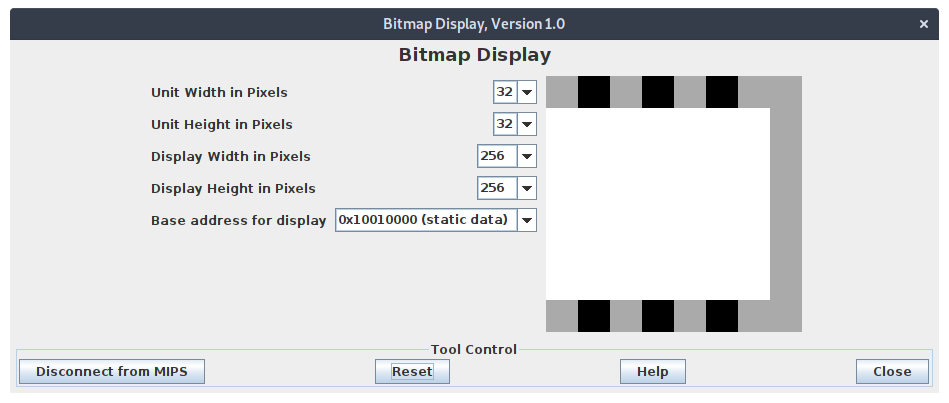
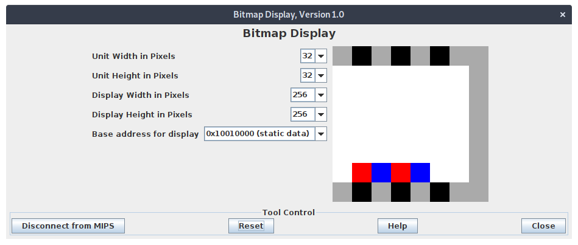

# Bitmap display

This document describe the usage of functions within the bitmap display module. It also provide
image for the display created (of the game board) from using said function.

All the code for such function is put within the file `update_display.asm`.

## The board



Here below we see a blank board, with the active portion colored white. Since the display is chosen
to be a 8x8 square, a 6x7 board draw on this display will left some row and column unused. Such row
and column is colored with grey (for the rightmost unused column) and with checkered pattern of grey
and black (for the top and bottom row). What left is the space of size 6x7, where in all the pieces
are drawn.

## Function

```{.c}
// BITMAP DISPLAY FUNCTION
// ____________________________________________________________________________
// clear display
void update_display_clear(void);
// update display with new piece
void update_display_add_new_piece(word_t column, byte_t player);
```

### `update_display_clear`

This function clear the current board and redraw a blank board, with all the outer unused column and
row outlined with special color and pattern.

### `update_display_add_new_piece`

This function will read the current column height of the specified column, and draw the new piece on
top of said column. The new piece will the the color of the corresponding player.

## Test program

A test program that clear the board and draw two piece is incluced in the file (you need to run this
file independently). The output of such test program can be seen below.


